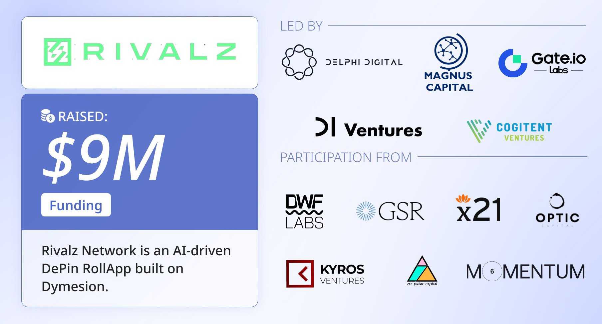

<h2 align=center> Rivalz Node v2 Setup Guide </h2>

<p align="center">

</p>

---
## System Specifications

| Component        | Specification   |
|------------------|-----------------|
| **RAM**          | 4GB             |
| **Cores**        | 4 Cores (2.2GHz) |
| **Storage**      | 50GB SSD        |
| **Internet Speed**| 1Mbps           |
---

# Installation & Registration Guide

## 1/ Register Website [HERE](https://rivalz.ai?r=0xAiExp0)

- Connect Wallet & Twitter
- Add Testnet RPC & Claim Faucet
- Mint Fragmentz Daily
- Run Rivalz Node V1 & V2
## 2/ V1 Download [HERE](https://rivalz.ai/download)

## 3/ Install V2 (VPS or WSL) Command

- Install `screen` using the below commands
```bash
sudo apt-get update
```
```bash
sudo apt-get install screen
```

- Create a screen session (Rivalz) using the below command
```bash
screen -S Rivalz
```
- Now paste the below command
```bash
wget https://raw.githubusercontent.com/BidyutRoy2/Rivalz-Node-V2/main/rivalz.sh && chmod +x rivalz.sh && ./rivalz.sh
```

<p align="center">

</p>
- Enter your EVM wallet address which you connected during Registration
- Allocate 95% stoarge to the node cli
- Detach from the screen session using `Ctrl` + `A` + `D`
- Done ✅, now you can close your terminal

## List of Commands Rivalz rClient CLI

### Restart Node If WSL/VPS ShutDown (Open New Terminal)
```
rivalz run
``` 

### Update the rClient CLI configuration
```
rivalz change-hardware-config
```

### Change the wallet address of the rClient CLI
```
rivalz change-wallet
```

### Update the rClient CLI version
```
rivalz update-version
```

### Show the rClient CLI version
```
rivalz info
```


# ▄︻デ𝙂𝙚𝙩 𝙇𝙖𝙩𝙚𝙨𝙩 𝘼𝙞𝙧𝙙𝙧𝙤𝙥𝙨 & 𝙐𝙥𝙙𝙖𝙩𝙚𝙨═━一

### ▄︻デ𝙅𝙤𝙞𝙣 𝙏𝙚𝙡𝙚𝙜𝙧𝙖𝙢═━一 [🎀  𝐻𝒾𝒹𝒹𝑒𝓃 𝒢𝑒𝓂  🎀](https://t.me/hiddengemnews) 

### ░▒▓█►─═  𝓗𝓲𝒹ᗪ𝓔η Ǥέ𝕄 ═─◄█▓▒░
